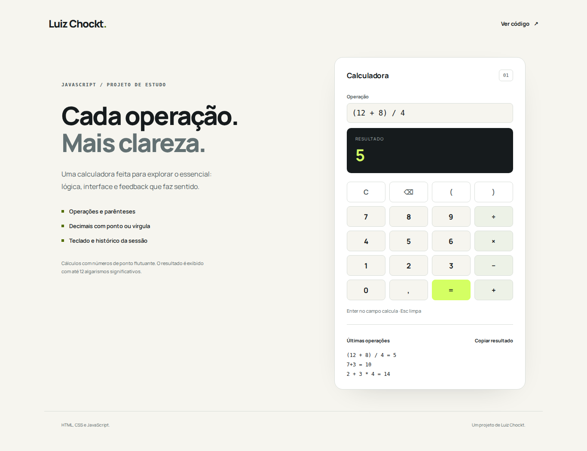

# Calculadora JavaScript

Uma calculadora web criada originalmente como exercício de aprendizagem em 2023 e reorganizada nesta versão com interface responsiva, módulos JavaScript e testes.

[**Experimentar a calculadora →**](https://luizchockt.github.io/CalculadoraAprendizadoJS/)



## O que faz

- Soma, subtração, multiplicação e divisão com precedência de operações.
- Parênteses, sinais negativos e decimais com ponto ou vírgula.
- Entrada por teclado e botões; Enter no campo calcula e Esc limpa.
- Histórico das cinco últimas operações durante a sessão.
- Feedback para expressões inválidas e divisão por zero.
- Cópia do resultado quando o navegador permite acesso à área de transferência.
- Interface que acompanha os temas claro e escuro do sistema.

## Executar

Não é necessário instalar dependências para a aplicação. Serve a pasta por HTTP, porque o JavaScript usa módulos ES:

```bash
git clone https://github.com/LuizChockt/CalculadoraAprendizadoJS.git
cd CalculadoraAprendizadoJS
python -m http.server 8000
```

Abre **http://localhost:8000**. Outra opção é a extensão Live Server do VS Code.

## Testar

Os testes usam o executor nativo do Node.js; não há dependências npm.

```bash
# Node.js 22 ou superior
npm test
```

Cobertura de comportamento: precedência, agrupamento, sinais, decimais, entradas inválidas, divisão por zero e rejeição de código executável. O workflow em `.github/workflows/tests.yml` executa os testes em pushes e pull requests.

## Decisões técnicas

- **Parser aritmético em vez de `eval`:** a expressão é interpretada como números e operadores, sem executar JavaScript fornecido na entrada.
- **Lógica separada da interface:** `src/calculator.mjs` concentra o cálculo; `src/app.mjs` trata eventos e atualizações da página.
- **HTML semântico e feedback textual:** labels, botões nativos, foco visível e anúncio de resultado por `aria-live`.
- **Fontes locais:** a interface não precisa requisitar fontes ou bibliotecas a terceiros.

| Arquivo | Função |
| --- | --- |
| `index.html` | Estrutura da interface |
| `styles.css` | Layout e temas |
| `src/calculator.mjs` | Parser e formatação numérica |
| `src/app.mjs` | Eventos e histórico |
| `tests/` | Testes de comportamento |
| `assets/` | Fonte, licença e captura da interface |

## Limites

É um projeto de estudo, não uma calculadora financeira ou científica. Usa números de ponto flutuante do JavaScript e apresenta até 12 algarismos significativos. Não aceita potência, porcentagem, funções ou notação científica. O histórico é mantido somente na sessão.

## Origem e evolução

A versão inicial foi um exercício acadêmico para aprender HTML, CSS e JavaScript. A revisão preserva esse contexto e trabalha organização, validação e apresentação.

## Licença

O arquivo [LICENSE](./LICENSE) original foi preservado. A fonte Manrope tem licença própria em [assets/OFL-Manrope.txt](./assets/OFL-Manrope.txt).
